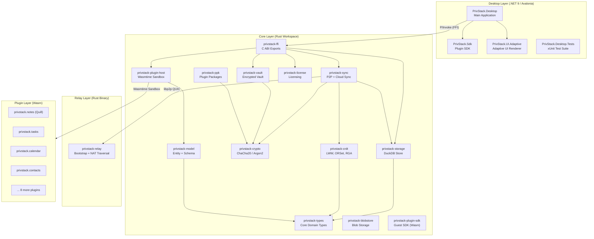
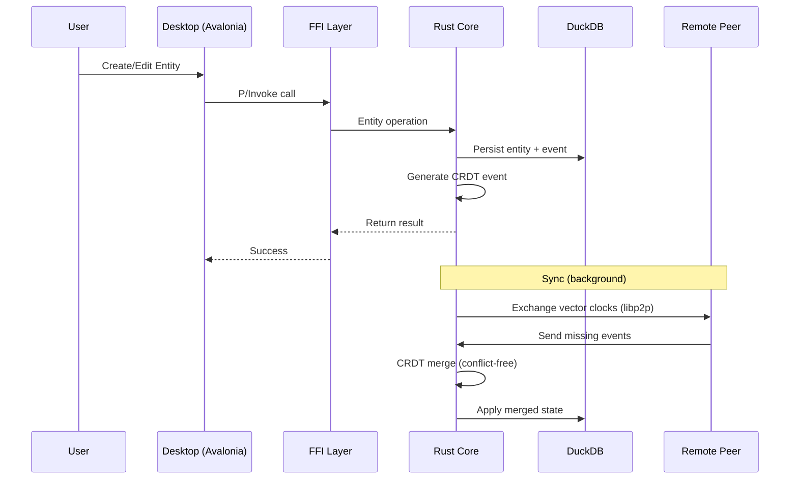

# PrivStack-IO

The core engine of PrivStack — a local-first, privacy-focused productivity suite. PrivStack-IO contains three primary layers (Core, Desktop, Relay) plus a plugin system that together deliver an offline-capable, peer-to-peer syncing application with end-to-end encryption.

## Architecture Overview



## Layer Descriptions

### 1. Core Layer (Rust)

A Cargo workspace of 13 crates providing all business logic, cryptography, sync, and storage. The desktop and mobile apps consume this layer via the FFI crate. All plugins run as sandboxed WebAssembly modules inside the Wasmtime-based plugin host — there are no in-process native plugins.

| Crate | Purpose |
|-------|---------|
| `privstack-types` | Domain primitives: `EntityId`, `PeerId`, `HybridTimestamp`, `Event` |
| `privstack-crdt` | CRDT implementations: LWW Register, OR-Set, RGA, PN-Counter, Vector Clock |
| `privstack-crypto` | ChaCha20-Poly1305 AEAD encryption, Argon2 key derivation, secure RNG |
| `privstack-storage` | DuckDB-backed entity and event store (WAL mode) |
| `privstack-vault` | Encrypted vault with content-addressed blob storage |
| `privstack-blobstore` | Namespace-scoped unencrypted blob storage (plugin-accessible) |
| `privstack-sync` | P2P sync (libp2p/QUIC/mDNS/Kademlia) + cloud sync (Google Drive, iCloud) |
| `privstack-model` | Universal `Entity` type, `EntitySchema`, merge strategies |
| `privstack-plugin-host` | Wasmtime-based WebAssembly plugin sandbox (Component Model) |
| `privstack-plugin-sdk` | Guest-side Rust SDK for writing Wasm plugins |
| `privstack-ppk` | `.ppk` plugin package format with Ed25519 signing/verification |
| `privstack-license` | License key validation, device fingerprinting, activation |
| `privstack-ffi` | C ABI exports for .NET (P/Invoke), Android (JNI), iOS (Swift interop) |

### 2. Desktop Layer (.NET 9 / Avalonia)

A cross-platform desktop application built with Avalonia UI targeting macOS, Windows, and Linux.

| Project | Purpose |
|---------|---------|
| `PrivStack.Desktop` | Main application: startup, DI, views, view models, services |
| `PrivStack.Sdk` | Plugin SDK: `IAppPlugin`, capability interfaces |
| `PrivStack.UI.Adaptive` | Adaptive UI renderer: rich text editor, syntax highlighting, diagram rendering |
| `PrivStack.Desktop.Tests` | xUnit test suite |

### 3. Relay Layer (Rust)

A standalone P2P relay and bootstrap node deployed on a VPS. Provides Kademlia DHT for peer discovery and QUIC relay for NAT traversal.

- **Port 4001/UDP** — QUIC relay for P2P traffic
- **Port 4002/TCP** — HTTP API for identity discovery (`/api/v1/identity`)

### 4. Plugin Layer (Wasm)

12 domain plugins are currently available:

| Plugin | Name | Description |
|--------|------|-------------|
| `privstack.notes` | Quill | Block-based note editor |
| `privstack.tasks` | Tasks | Task/todo management |
| `privstack.calendar` | Calendar | Calendar and events |
| `privstack.contacts` | Contacts | Contact management |
| `privstack.deals` | Deals | CRM/pipeline management |
| `privstack.files` | Files | File browser |
| `privstack.graph` | Graph | Knowledge graph visualization |
| `privstack.journal` | Journal | Journal/diary entries |
| `privstack.ledger` | Ledger | Accounting/ledger |
| `privstack.passwords` | Passwords | Encrypted password vault |
| `privstack.rss` | RSS | RSS feed reader |
| `privstack.snippets` | Snippets | Code snippet storage |

## Data Flow



## Prerequisites

### Rust (Core + Relay)

- **Rust 1.83+** (install via [rustup](https://rustup.rs/))
- **DuckDB** development headers (bundled via cargo, no manual install needed)
- **C compiler** (for native dependencies) — Xcode CLI tools on macOS, `build-essential` on Linux, MSVC on Windows

### .NET (Desktop)

- **.NET 9 SDK** (download from [dotnet.microsoft.com](https://dotnet.microsoft.com/download/dotnet/9.0))
- **Avalonia templates** (optional): `dotnet new install Avalonia.Templates`

## Build Instructions

### Step 1: Build the Rust Core

The .NET desktop app requires the native FFI library. Build this first.

```bash
cd PrivStack-IO/core

# Debug build (faster compilation)
cargo build

# Release build (optimized, LTO enabled)
cargo build --release
```

This produces the native library:
- **macOS:** `target/release/libprivstack_ffi.dylib`
- **Linux:** `target/release/libprivstack_ffi.so`
- **Windows:** `target/release/privstack_ffi.dll`

### Step 2: Build the Desktop App

```bash
cd PrivStack-IO/desktop/PrivStack.Desktop

# Debug build
dotnet build

# Release build
dotnet build -c Release
```

The `.csproj` automatically picks up the native library from `../../core/target/release/` based on the current OS.

### Step 3: Build the Relay (Optional)

Only needed if deploying your own relay node.

```bash
cd PrivStack-IO/relay

# Release build
cargo build --release
```

Output: `target/release/privstack-relay`

### Step 4: Build Wasm Plugins (Optional)

Plugin sources are in `PrivStack-Plugins/wasm/`. To rebuild:

```bash
cd PrivStack-Plugins/wasm/privstack-plugin-notes

# Requires wasm32-unknown-unknown target
rustup target add wasm32-unknown-unknown

cargo build --target wasm32-unknown-unknown --release
```

## Running

### Desktop Application

```bash
cd PrivStack-IO/desktop/PrivStack.Desktop

# Run in debug mode
dotnet run

# Run release build
dotnet run -c Release
```

On first launch, a setup wizard guides you through initial configuration (vault password, workspace setup).

### Relay Server

```bash
# Run directly
./target/release/privstack-relay

# With custom identity key
./target/release/privstack-relay --identity /path/to/relay-identity.key

# With verbose logging
./target/release/privstack-relay --verbose
```

For production deployment as a systemd service, see the [Relay Wiki](Wiki/relay-deployment.md).

### Running Tests

```bash
# Rust core tests
cd PrivStack-IO/core
cargo test

# .NET desktop tests
cd PrivStack-IO/desktop
dotnet test

# Rust tests with logging
cd PrivStack-IO/core
RUST_LOG=debug cargo test
```

## Cross-Compilation

The desktop app supports cross-platform builds via runtime identifiers:

```bash
# macOS ARM64
dotnet publish -c Release -r osx-arm64

# macOS x64
dotnet publish -c Release -r osx-x64

# Windows x64
dotnet publish -c Release -r win-x64

# Linux x64
dotnet publish -c Release -r linux-x64
```

For cross-compiled native libraries, place them in the `dist/` folder:

```
dist/
  macos-arm64/native/libprivstack_ffi.dylib
  macos-x64/native/libprivstack_ffi.dylib
  windows-x64/native/privstack_ffi.dll
  linux-x64/native/libprivstack_ffi.so
```

## Project Structure

```
PrivStack-IO/
├── core/                           # Rust workspace (13 crates)
│   ├── privstack-types/            # Domain primitives
│   ├── privstack-crdt/             # CRDT algorithms
│   ├── privstack-crypto/           # Encryption & key derivation
│   ├── privstack-storage/          # DuckDB persistence
│   ├── privstack-vault/            # Encrypted vault
│   ├── privstack-blobstore/        # Blob storage
│   ├── privstack-sync/             # P2P + cloud sync engine
│   ├── privstack-model/            # Entity model & schemas
│   ├── privstack-plugin-host/      # Wasmtime plugin sandbox
│   ├── privstack-plugin-sdk/       # Wasm guest SDK
│   ├── privstack-ppk/              # Plugin package format
│   ├── privstack-license/          # Licensing
│   ├── privstack-ffi/              # C ABI exports
│   └── Cargo.toml                  # Workspace manifest
├── desktop/                        # .NET 9 desktop app
│   ├── PrivStack.Desktop/          # Main application
│   ├── PrivStack.Sdk/              # Plugin SDK
│   ├── PrivStack.UI.Adaptive/      # Adaptive UI library
│   └── PrivStack.Desktop.Tests/    # Test suite
├── relay/                          # P2P relay server
├── plugins/                        # Compiled Wasm plugins (12)
└── README.md
```

## Technology Stack

| Component | Technology | Version |
|-----------|-----------|---------|
| Desktop UI | Avalonia | 11.3.11 |
| Desktop Framework | .NET | 9.0 |
| MVVM | CommunityToolkit.Mvvm | 8.2.1 |
| Dependency Injection | Microsoft.Extensions.DI | 10.0.2 |
| Logging | Serilog | 4.2.0 |
| Async Runtime | Tokio | 1.43 |
| Serialization | Serde | 1.0 |
| Encryption | ChaCha20-Poly1305 | 0.10 |
| Key Derivation | Argon2 | 0.5 |
| Database | DuckDB | 1.1 |
| P2P Networking | libp2p | 0.56 |
| Plugin Runtime | Wasmtime | 33 |
| Plugin Signing | Ed25519 | 2.1 |
| Speech-to-Text | Whisper.net | 1.8.0 |
| Auto-Update | Velopack | 0.0.942 |

## License

Proprietary. See [LICENSE](LICENSE) for details.
