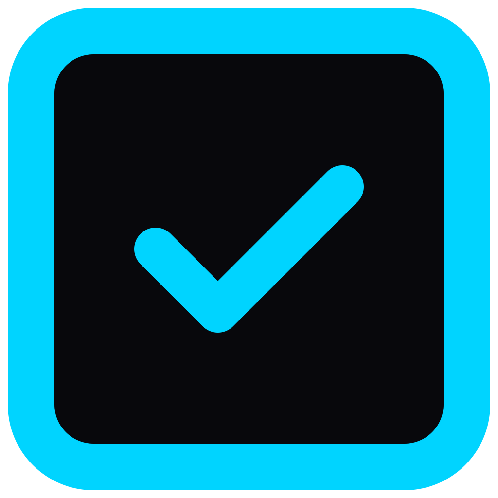

<p align="center">
  
</p>

<h1 align="center">PrivStack</h1>

<p align="center">
  A local-first, privacy-focused productivity suite.<br/>
  Your data stays on your device. No cloud required.
</p>

<p align="center">
  <a href="https://privstack.io">Website</a> &middot;
  <a href="https://privstack.io/docs">Docs</a> &middot;
  <a href="https://privstack.io/changelog">Changelog</a> &middot;
  <a href="https://privstack.io/roadmap">Roadmap</a>
</p>

---

PrivStack is a desktop productivity suite that replaces cloud-dependent tools like Notion, Todoist, and Google Calendar with a single offline-capable application. Everything is encrypted on your device and syncs peer-to-peer between your machines — no accounts, no servers, no SaaS.

## Why PrivStack

- **Offline by default** — Fully functional without an internet connection. Your data lives in a local database, not someone else's server.
- **End-to-end encrypted** — All sensitive data is encrypted with ChaCha20-Poly1305 before it touches disk. Your master key is derived from your password via Argon2 and never stored.
- **Peer-to-peer sync** — Devices discover each other over the local network or the internet and sync directly using libp2p. No cloud middleman. Conflicts are resolved automatically with CRDTs.
- **Plugin-based** — Every feature (notes, tasks, calendar, etc.) runs as a sandboxed WebAssembly plugin. Install only what you need.
- **Cross-platform** — macOS, Windows, and Linux from a single codebase.

## Modules

| Module | Description |
|--------|-------------|
| **Quill** (Notes) | Block-based editor with backlinks, markdown, and full-text search |
| **Tasks** | Lists and Kanban boards with recurring tasks, priorities, and due dates |
| **Calendar** | Day, week, and month views with CalDAV import |
| **Journal** | Time-stamped entries with mood tracking and rich formatting |
| **Contacts** | People and companies with groups and vCard import/export |
| **Files** | Encrypted file vault with preview and organization |
| **Graph** | Interactive knowledge graph connecting notes and entities |
| **Snippets** | Code snippet storage with syntax highlighting for 20+ languages |
| **RSS** | Feed reader with offline reading and OPML import/export |
| **Passwords** | Encrypted password vault |
| **Deals** | CRM pipeline management |
| **Ledger** | Double-entry accounting |

## Architecture

PrivStack is built in three layers:

**Core (Rust)** — 13 crates handling encryption, CRDT sync, storage, P2P networking, and the WebAssembly plugin runtime. This is where all business logic lives.

**Desktop (.NET 9 / Avalonia)** — Cross-platform UI that communicates with the Rust core via P/Invoke (FFI). Includes the adaptive UI renderer, theme system, spell checking, and speech-to-text.

**Relay (Rust)** — An optional bootstrap node for peer discovery and NAT traversal. Not required for local network sync.

```
PrivStack-IO/
├── core/               # Rust workspace (13 crates)
│   ├── privstack-ffi/          # C ABI exports for .NET / mobile
│   ├── privstack-crypto/       # ChaCha20-Poly1305, Argon2
│   ├── privstack-crdt/         # LWW Register, OR-Set, RGA, Vector Clock
│   ├── privstack-sync/         # libp2p P2P + cloud sync engine
│   ├── privstack-storage/      # DuckDB persistence (WAL mode)
│   ├── privstack-vault/        # Encrypted blob vault
│   ├── privstack-plugin-host/  # Wasmtime WebAssembly sandbox
│   ├── privstack-model/        # Entity model and schemas
│   ├── privstack-types/        # Domain primitives
│   ├── privstack-blobstore/    # Plugin blob storage
│   ├── privstack-plugin-sdk/   # Guest SDK for Wasm plugins
│   ├── privstack-ppk/          # Plugin package format (.ppk)
│   └── privstack-license/      # License validation
├── desktop/            # .NET 9 Avalonia application
│   ├── PrivStack.Desktop/      # Main app (views, view models, services)
│   ├── PrivStack.Sdk/          # Plugin SDK interfaces
│   ├── PrivStack.UI.Adaptive/  # Rich text, syntax highlighting, diagrams
│   └── PrivStack.Desktop.Tests/
├── relay/              # P2P relay server
└── Wiki/               # Developer documentation
```

For detailed architecture documentation, see the [Wiki](Wiki/).

## Tech Stack

| Layer | Technology |
|-------|-----------|
| Core logic | Rust, Tokio, Serde |
| Database | DuckDB (WAL mode) |
| Encryption | ChaCha20-Poly1305, Argon2id |
| P2P networking | libp2p (QUIC, mDNS, Kademlia DHT) |
| Plugin runtime | Wasmtime (WebAssembly Component Model) |
| Plugin signing | Ed25519 |
| Desktop UI | .NET 9, Avalonia 11 |
| MVVM | CommunityToolkit.Mvvm |
| Speech-to-text | Whisper.net (local, offline) |

## Getting Started

### Prerequisites

- **Rust 1.85+** — [rustup.rs](https://rustup.rs/)
- **.NET 9 SDK** — [dotnet.microsoft.com](https://dotnet.microsoft.com/download/dotnet/9.0)
- **C compiler** — Xcode CLI tools (macOS), `build-essential` (Linux), or MSVC (Windows)

### Build

```bash
cd PrivStack-IO

# Build everything (core + desktop) — recommended
./build.sh

# Or build manually:
cd core && cargo build --release
cd ../desktop/PrivStack.Desktop && dotnet build -c Release
```

### Run

```bash
# Via build script
./build.sh --run

# Or directly
cd desktop/PrivStack.Desktop && dotnet run
```

On first launch, a setup wizard walks you through creating your vault password and workspace.

### Test

```bash
# Rust core
cd core && cargo test

# .NET desktop
cd desktop && dotnet test
```

### Build Script Options

```bash
./build.sh                  # Debug build (core + desktop)
./build.sh --release        # Release build
./build.sh --run            # Build and launch
./build.sh --run --rebuild  # Force full rebuild and launch
./build.sh --skip-core      # Skip Rust build (desktop only)
./build.sh --test           # Run all tests
./build.sh --fresh --run    # Wipe local data and start fresh
```

## Cross-Compilation

```bash
dotnet publish -c Release -r osx-arm64    # macOS Apple Silicon
dotnet publish -c Release -r osx-x64      # macOS Intel
dotnet publish -c Release -r win-x64      # Windows
dotnet publish -c Release -r linux-x64    # Linux
```

Pre-built native libraries should be placed in `dist/<platform>/native/`.

## Documentation

Developer documentation is in the [Wiki](Wiki/) directory:

- [Architecture Overview](Wiki/architecture-overview.md) — System layers, data flow, design principles
- [Entity Model](Wiki/entity-model.md) — Entities, schemas, field types, merge strategies
- [CRDT System](Wiki/crdt-system.md) — Conflict-free replicated data types
- [Sync Engine](Wiki/sync-engine.md) — P2P and cloud sync protocol
- [Cryptography](Wiki/cryptography.md) — Encryption, key derivation, vault architecture
- [Storage Layer](Wiki/storage-layer.md) — DuckDB persistence
- [Plugin Architecture](Wiki/plugin-architecture.md) — Wasm sandbox, lifecycle, capabilities
- [Plugin Package Format](Wiki/plugin-package-format.md) — `.ppk` format and signing
- [Plugin SDK](Wiki/plugin-sdk.md) — Writing plugins with the guest SDK
- [FFI Reference](Wiki/ffi-reference.md) — C ABI for .NET, Android, iOS
- [Relay Deployment](Wiki/relay-deployment.md) — Deploying the relay server

## License

[Polyform Internal Use License 1.0.0](LICENSE)
