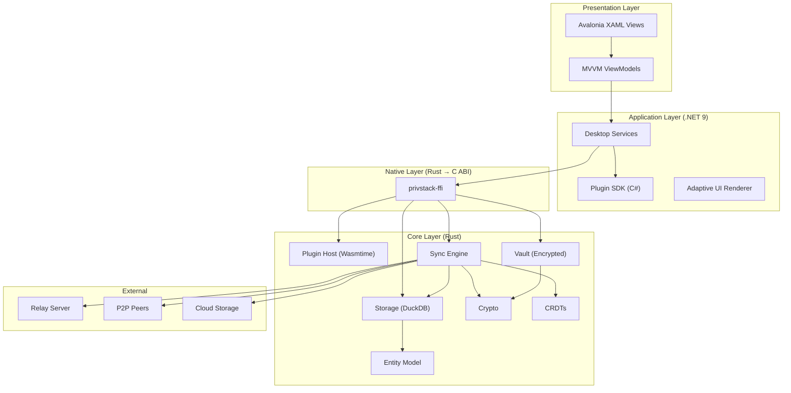
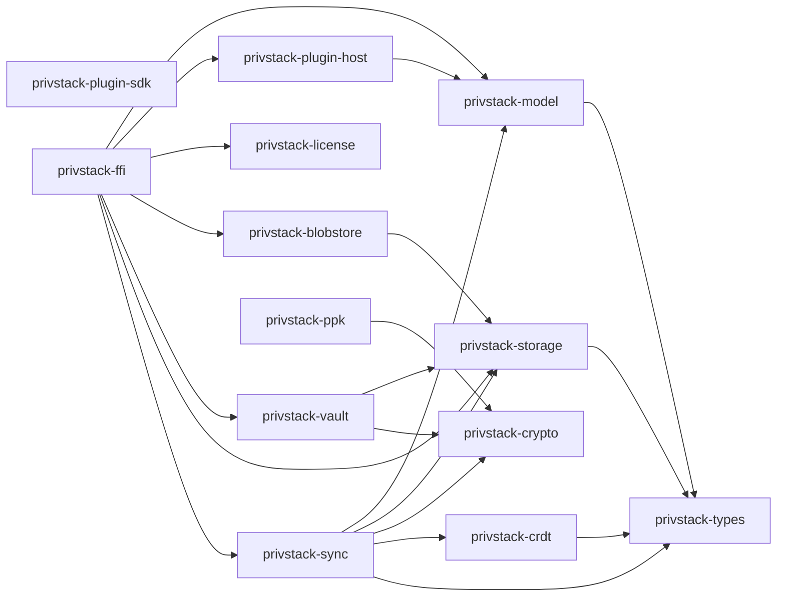
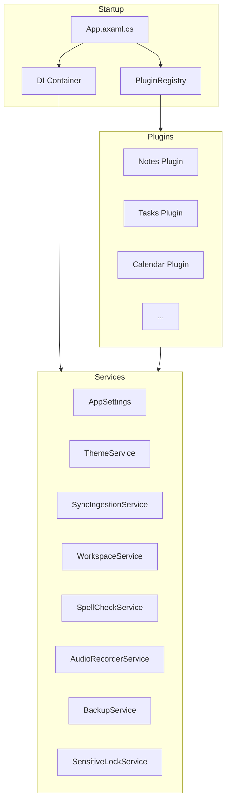

# Architecture Overview

PrivStack-IO is structured as a three-layer system: a Rust core for all business logic, a .NET/Avalonia desktop shell, and a standalone P2P relay server. Plugins extend functionality via WebAssembly sandboxing.

## System Layers

## Design Principles

1. **Local-First** — All data lives on the device. The app functions fully offline. Sync is opportunistic.
2. **Zero Cloud Reliance** — No PrivStack servers hold user data. Cloud storage (Google Drive, iCloud) is an optional user-chosen sync transport.
3. **Privacy by Default** — E2E encryption (ChaCha20-Poly1305), Argon2 key derivation, zero-knowledge vault. Telemetry is opt-in only.
4. **Plugin Isolation** — All plugins run as sandboxed WebAssembly modules in Wasmtime with capability-based permissions. In-process C# plugins were deprecated as insecure. No plugin can access another plugin's data without explicit cross-plugin linking.
5. **Conflict-Free Sync** — CRDTs ensure all peers converge to the same state without coordination or conflict resolution UI.

## Crate Dependency Graph

## Desktop Application Architecture

The desktop app uses MVVM with dependency injection:

### Startup Sequence

1. Avalonia framework initializes
2. DI container configured (services, logging, settings)
3. Native FFI library loaded (P/Invoke)
4. Vault unlock screen shown (password entry)
5. Wasm plugin discovery from plugin directory (`.ppk` packages and `.wasm` binaries)
6. Plugins initialized in navigation order
7. Main window displayed with tabbed plugin layout

### Key Services

| Service | Responsibility |
|---------|---------------|
| `PluginRegistry` | Discovers Wasm plugins, loads via FFI, and manages plugin lifecycle |
| `WasmPluginProxy` | Proxies .NET plugin calls to Wasm plugins via FFI |
| `SyncIngestionService` | Consumes sync events from the Rust core and updates UI state |
| `WorkspaceService` | Manages multiple workspaces (each with isolated data) |
| `AppSettings` | Persists configuration with debounced saves |
| `ThemeService` | Light/dark/custom theme management |
| `BackupService` | Automatic periodic backups |
| `SensitiveLockService` | Re-locks sensitive plugins (Passwords, Vault) after timeout |
| `AudioRecorderService` | Whisper.net speech-to-text integration |
| `SpellCheckService` | Hunspell-based spell checking |

## Platform Targets

| Platform | Runtime | UI | Native Library |
|----------|---------|-----|---------------|
| macOS (ARM64) | .NET 9 | Avalonia | `libprivstack_ffi.dylib` |
| macOS (x64) | .NET 9 | Avalonia | `libprivstack_ffi.dylib` |
| Windows (x64) | .NET 9 | Avalonia | `privstack_ffi.dll` |
| Linux (x64) | .NET 9 | Avalonia | `libprivstack_ffi.so` |
| Android | Kotlin | Jetpack Compose | `libprivstack_ffi.so` (JNI) |
| iOS | Swift | SwiftUI | `libprivstack_ffi.a` (static) |

## Performance Considerations

- **ReadyToRun (R2R)** — .NET release builds use ahead-of-time compilation for faster startup
- **Tiered Compilation** — JIT recompiles hot paths at higher optimization levels
- **Rust Release Profile** — LTO, single codegen unit, abort-on-panic, symbol stripping
- **DuckDB WAL Mode** — Write-ahead logging for concurrent reads during sync
- **Lazy Plugin ViewModels** — ViewModels created on first navigation, not at startup
