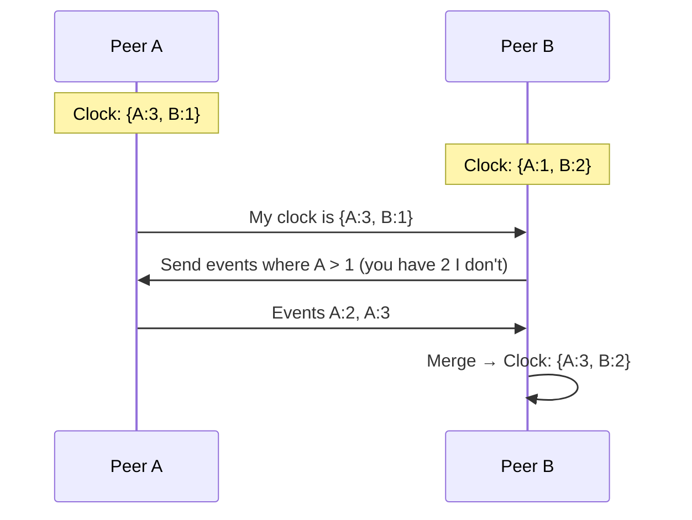
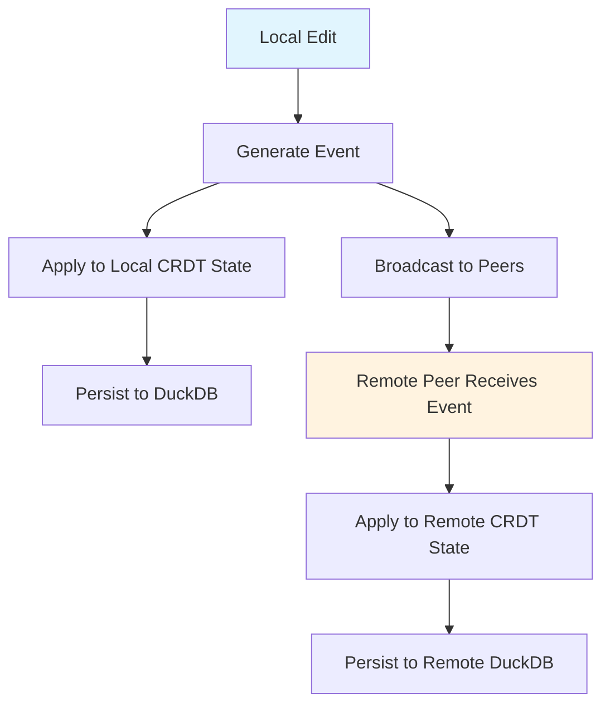

# CRDT System

PrivStack uses Conflict-free Replicated Data Types (CRDTs) to ensure all peers converge to the same state without coordination. The `privstack-crdt` crate provides five CRDT implementations.

## Why CRDTs

In a P2P system with no central server, concurrent edits are inevitable. Traditional conflict resolution (last-write-wins at the document level, or manual merge) either loses data or requires user intervention. CRDTs guarantee **strong eventual consistency**: if all peers have seen the same set of operations, they arrive at the same state — regardless of the order operations were applied.

All CRDTs satisfy three mathematical properties:
- **Commutative** — Order of application doesn't matter
- **Associative** — Grouping of application doesn't matter
- **Idempotent** — Applying the same operation twice has no additional effect

## CRDT Implementations

### Vector Clock

Tracks causality across peers. Each peer maintains a logical counter, incremented on every local operation.

```rust
pub struct VectorClock {
    // Map of PeerId → logical counter
}

pub enum CausalOrder {
    Before,
    After,
    Concurrent,
    Equal,
}

impl VectorClock {
    pub fn new() -> Self
    pub fn increment(&mut self, peer_id: &PeerId)
    pub fn merge(&mut self, other: &VectorClock)
    pub fn compare(&self, other: &VectorClock) -> CausalOrder
    pub fn get(&self, peer_id: &PeerId) -> u64
}
```

**Usage in sync:** Before exchanging events, peers compare vector clocks to determine which events the other peer is missing. This avoids retransmitting already-known events.



### LWW Register (Last-Writer-Wins)

Holds a single value. Concurrent writes are resolved by timestamp — the most recent write wins.

```rust
pub struct LWWRegister<T> {
    // value + timestamp
}

impl<T> LWWRegister<T> {
    pub fn new(value: T, timestamp: HybridTimestamp) -> Self
    pub fn set(&mut self, value: T, timestamp: HybridTimestamp)
    pub fn get(&self) -> &T
    pub fn timestamp(&self) -> HybridTimestamp
    pub fn merge(&mut self, other: &LWWRegister<T>)
}
```

**Used for:** Individual entity fields when `MergeStrategy::LwwPerField` is active. Each top-level JSON field in an entity is treated as an independent LWW register.

### OR-Set (Observed-Remove Set)

A set where elements can be added and removed concurrently without losing data. Each addition is tagged with a unique identifier. Removal only removes the specific tags observed at the time.

```rust
pub struct ORSet<T> {
    // elements with unique tags
}

pub struct Tag {
    // unique operation identifier
}

impl<T> ORSet<T> {
    pub fn new() -> Self
    pub fn insert(&mut self, value: T, peer_id: &PeerId) -> Tag
    pub fn remove(&mut self, value: &T)
    pub fn contains(&self, value: &T) -> bool
    pub fn elements(&self) -> Vec<&T>
    pub fn merge(&mut self, other: &ORSet<T>)
}
```

**Used for:** Collections like tags, labels, or linked entity sets. If Peer A adds a tag while Peer B removes a different tag, both operations are preserved.

### PN-Counter (Positive-Negative Counter)

A distributed counter that supports both increment and decrement. Internally tracks per-peer positive and negative counts.

```rust
pub struct PNCounter {
    // per-peer positive counts + per-peer negative counts
}

impl PNCounter {
    pub fn new() -> Self
    pub fn increment(&mut self, peer_id: &PeerId)
    pub fn decrement(&mut self, peer_id: &PeerId)
    pub fn value(&self) -> i64
    pub fn merge(&mut self, other: &PNCounter)
}
```

**Used for:** Distributed counters mapped to the `Counter` field type in entity schemas.

### RGA (Replicated Growable Array)

An ordered sequence supporting insert and delete at any position. Used for collaborative text editing and ordered lists.

```rust
pub struct RGA<T> {
    // elements with unique position identifiers
}

pub struct ElementId {
    // globally unique element position
}

impl<T> RGA<T> {
    pub fn new(peer_id: PeerId) -> Self
    pub fn insert_after(&mut self, after: Option<&ElementId>, value: T) -> ElementId
    pub fn delete(&mut self, id: &ElementId)
    pub fn to_vec(&self) -> Vec<&T>
    pub fn merge(&mut self, other: &RGA<T>)
}
```

**Used for:** Rich text content, ordered task lists, or any sequence where position matters and concurrent inserts at the same location must both be preserved.

## Integration with Sync



1. A local edit generates an `Event` (immutable, append-only)
2. The event is applied to local CRDT state and persisted
3. The event is broadcast to connected peers via the sync engine
4. Remote peers apply the event to their CRDT state
5. All peers converge to the same final state

## Hybrid Timestamps

PrivStack uses **Hybrid Logical Clocks (HLC)** that combine wall-clock time with a logical counter. This provides:

- **Physical ordering** — Events are roughly ordered by real time
- **Causality tracking** — If event A caused event B, A's timestamp is always less than B's
- **No clock sync required** — Works correctly even with clock skew between devices
