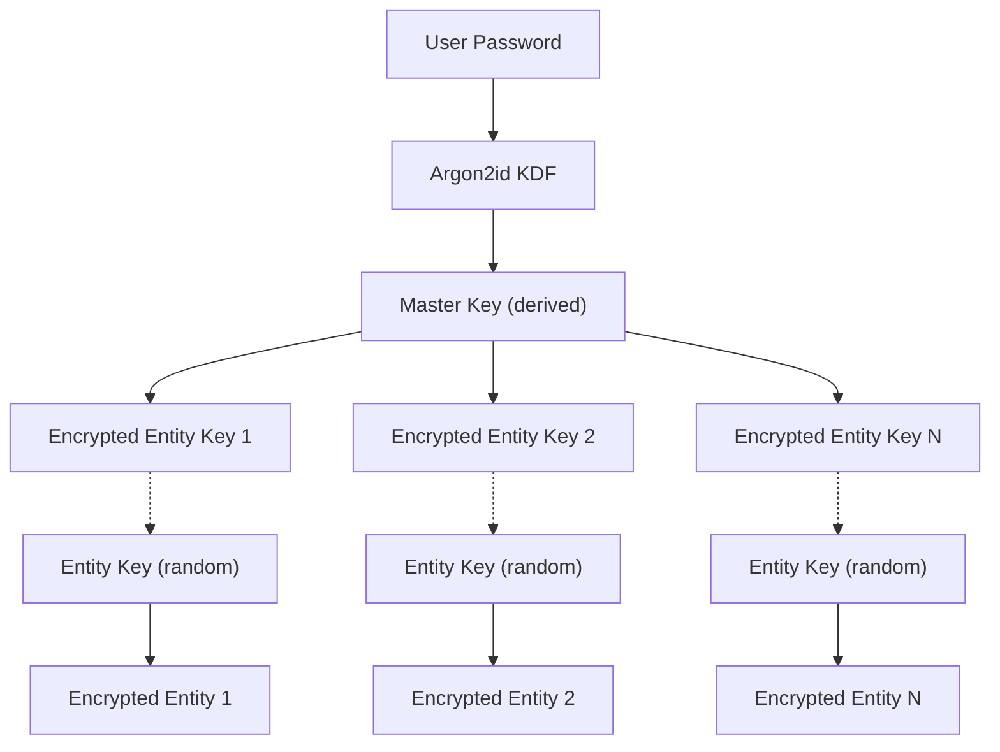

# Cryptography

The `privstack-crypto` crate provides all encryption, key derivation, and secure storage primitives used throughout PrivStack.

## Algorithms

| Purpose | Algorithm | Standard |
|---------|-----------|----------|
| Symmetric Encryption | ChaCha20-Poly1305 | RFC 8439 (AEAD) |
| Key Derivation | Argon2id | RFC 9106 |
| Random Generation | OS CSPRNG | Via `rand` crate |
| Plugin Signing | Ed25519 | RFC 8032 (in `privstack-ppk`) |
| Memory Safety | Zeroize | Secrets zeroed on drop |

## Key Hierarchy



1. **Master Key** — Derived from the user's password via Argon2id. Never stored directly.
2. **Entity Keys** — Random 256-bit keys generated per entity. Encrypted with the master key and stored alongside the entity.
3. **Password Change** — Only re-encrypts entity keys (not all entity data), making password changes fast.

## Core API

### Key Derivation

```rust
pub fn derive_key(password: &str, params: &KdfParams) -> DerivedKey

pub struct KdfParams {
    pub salt: Salt,              // 16 bytes
    pub memory_cost: u32,        // Argon2 memory (KiB)
    pub time_cost: u32,          // Argon2 iterations
    pub parallelism: u32,        // Argon2 threads
}

pub struct DerivedKey {
    // 32 bytes, zeroized on drop
}

pub fn generate_random_key() -> [u8; KEY_SIZE]  // KEY_SIZE = 32

pub const KEY_SIZE: usize = 32;
pub const SALT_SIZE: usize = 16;
```

### Encryption / Decryption

```rust
pub fn encrypt(key: &[u8], plaintext: &[u8]) -> EncryptedData
pub fn decrypt(key: &[u8], data: &EncryptedData) -> Vec<u8>

pub fn encrypt_string(key: &[u8], plaintext: &str) -> EncryptedData
pub fn decrypt_string(key: &[u8], data: &EncryptedData) -> String

pub struct EncryptedData {
    pub nonce: [u8; NONCE_SIZE],   // 12 bytes
    pub ciphertext: Vec<u8>,       // includes 16-byte Poly1305 tag
}

pub const NONCE_SIZE: usize = 12;
pub const TAG_SIZE: usize = 16;
```

### Document-Level Encryption

For entities with per-document keys:

```rust
pub fn encrypt_document(master_key: &[u8], plaintext: &[u8]) -> EncryptedDocument
pub fn decrypt_document(master_key: &[u8], doc: &EncryptedDocument) -> Vec<u8>
pub fn reencrypt_document_key(
    old_master: &[u8],
    new_master: &[u8],
    doc: &EncryptedDocument
) -> EncryptedDocument

pub struct EncryptedDocument {
    pub metadata: EncryptedDocumentMetadata,  // encrypted entity key
    pub data: EncryptedData,                   // encrypted payload
}
```

### DataEncryptor Trait

Abstraction for encryption backends (vault, passthrough):

```rust
pub trait DataEncryptor: Send + Sync {
    fn encrypt_bytes(&self, entity_id: &str, data: &[u8]) -> EncryptorResult<Vec<u8>>;
    fn decrypt_bytes(&self, data: &[u8]) -> EncryptorResult<Vec<u8>>;
    fn reencrypt_bytes(
        &self,
        data: &[u8],
        old_key: &[u8],
        new_key: &[u8]
    ) -> EncryptorResult<Vec<u8>>;
    fn is_available(&self) -> bool;
}
```

`VaultManager` implements this trait, providing transparent encryption for all entity storage operations.

## Vault Integration

The vault (`privstack-vault`) uses `privstack-crypto` to provide:

- **Password-protected storage** — Vault must be unlocked with the correct password before any read/write
- **Per-blob encryption** — Each blob (file, credential, etc.) encrypted independently
- **Content-addressed storage** — Blobs identified by SHA-256 hash
- **Minimum password length** — 8 characters enforced

```rust
impl VaultManager {
    pub fn initialize(&self, vault_id: &str, password: &str) -> VaultResult<()>
    pub fn unlock(&self, vault_id: &str, password: &str) -> VaultResult<()>
    pub fn lock(&self, vault_id: &str)
    pub fn store_blob(&self, vault_id: &str, blob_id: &str, data: &[u8]) -> VaultResult<()>
    pub fn read_blob(&self, vault_id: &str, blob_id: &str) -> VaultResult<Vec<u8>>
    pub fn change_password(&self, vault_id: &str, old: &str, new: &str) -> VaultResult<()>
}
```

## Security Properties

- **At-rest encryption** — All sensitive data encrypted in DuckDB via ChaCha20-Poly1305
- **Memory safety** — Keys zeroized on drop (via `zeroize` crate)
- **No key storage** — Master key exists only in memory while vault is unlocked
- **Forward secrecy per entity** — Compromising one entity key doesn't expose others
- **Authenticated encryption** — Poly1305 MAC prevents tampering
- **Brute-force resistance** — Argon2id with configurable memory/time cost
