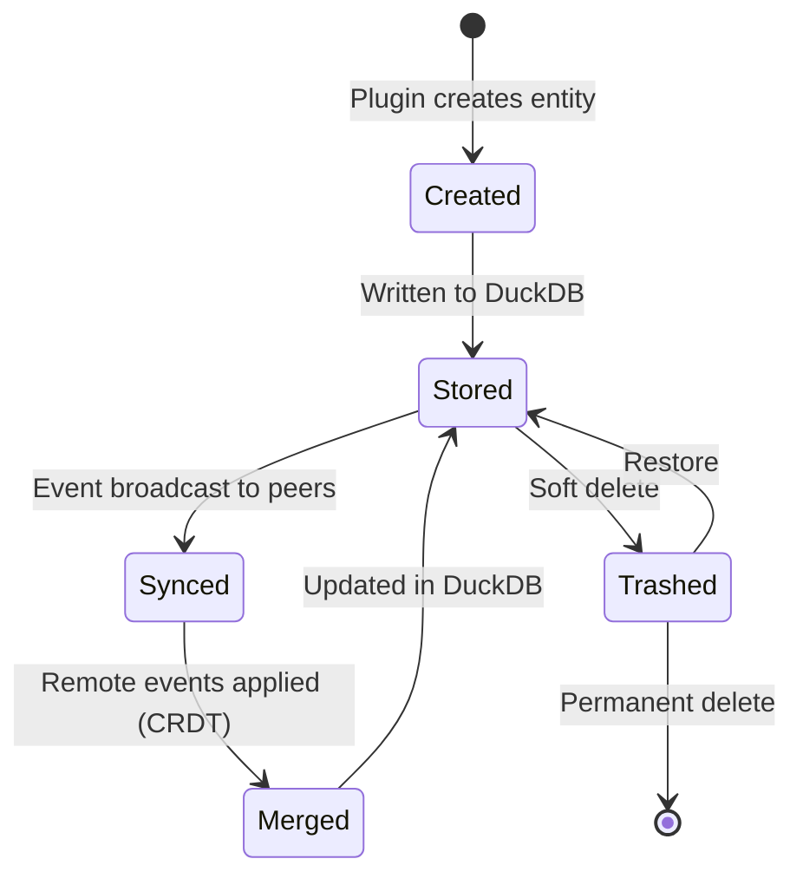

# Entity Model

All data in PrivStack is represented as **Entities** — typed JSON documents with schema-driven indexing and CRDT-based merge strategies.

## Entity Structure

Every entity across all plugins shares a common envelope:

```rust
// Rust (privstack-model)
pub struct Entity {
    pub id: String,           // UUID v7 (time-ordered)
    pub entity_type: String,  // e.g., "note", "task", "contact"
    pub data: Value,          // JSON payload (plugin-defined)
    pub created_at: i64,      // Hybrid timestamp
    pub modified_at: i64,     // Hybrid timestamp
    pub created_by: String,   // PeerId of creating device
}
```

Entities are identified by a UUID v7, which provides both uniqueness and time-ordering. The `entity_type` determines which plugin owns the entity and which schema governs its indexing and merge behavior.

## Entity Schema

Each plugin declares its entity types via `EntitySchema`:

```rust
// Rust
pub struct EntitySchema {
    pub entity_type: String,
    pub indexed_fields: Vec<IndexedField>,
    pub merge_strategy: MergeStrategy,
}
```

```csharp
// C# (PrivStack.Sdk)
public sealed record EntitySchema
{
    public required string EntityType { get; init; }
    public required IReadOnlyList<IndexedField> IndexedFields { get; init; }
    public required MergeStrategy MergeStrategy { get; init; }
}
```

Schemas are registered during plugin initialization and drive:
- **Storage indexing** — Which fields are extracted from JSON for efficient queries
- **Search** — Which fields are full-text searchable
- **Sync merge** — How concurrent edits from multiple peers are reconciled

## Field Types

Each indexed field has a type that determines storage representation and query capabilities:

| Field Type | Description | Example Use |
|-----------|-------------|-------------|
| `Text` | Free-form string, optionally full-text searchable | Note title, body |
| `Tag` | Short categorical string, exact-match queries | Labels, categories |
| `DateTime` | Timestamp (range queries supported) | Due date, created date |
| `Number` | 64-bit floating point | Priority, sort order |
| `Bool` | Boolean flag | Is completed, is archived |
| `Vector` | Fixed-dimension float array (for embeddings) | Semantic search vectors |
| `Counter` | Distributed counter (backed by PN-Counter CRDT) | View count, vote count |
| `Relation` | Foreign key to another entity | Parent note, assigned contact |
| `Decimal` | High-precision decimal | Financial amounts |
| `Json` | Nested JSON blob (stored but not indexed internally) | Plugin-specific metadata |
| `Enum` | Constrained string from a predefined set | Status (open/closed/archived) |
| `GeoPoint` | Latitude/longitude pair | Location data |
| `Duration` | Time duration | Pomodoro timer, estimated effort |

### Creating Indexed Fields (C#)

The SDK provides fluent factory methods:

```csharp
var schema = new EntitySchema
{
    EntityType = "note",
    MergeStrategy = MergeStrategy.LwwPerField,
    IndexedFields = [
        IndexedField.Text("/title", searchable: true),
        IndexedField.Text("/body", searchable: true),
        IndexedField.Tag("/folder_id"),
        IndexedField.DateTime("/created_at"),
        IndexedField.DateTime("/modified_at"),
        IndexedField.Bool("/is_trashed"),
        IndexedField.Bool("/is_pinned"),
        IndexedField.Number("/sort_order"),
    ]
};
```

Field paths use JSON Pointer syntax (RFC 6901). The leading `/` references a top-level key in the entity's `data` payload.

## Merge Strategies

When two peers edit the same entity concurrently, the merge strategy determines reconciliation:

| Strategy | Behavior | Use Case |
|----------|----------|----------|
| `LwwDocument` | Last-writer-wins for the entire document. The most recent write replaces the whole entity. | Simple entities where partial merge isn't meaningful (e.g., settings) |
| `LwwPerField` | Last-writer-wins per top-level JSON field. Each field merges independently based on its timestamp. | Most entities — preserves concurrent non-conflicting edits to different fields |
| `Custom` | Plugin provides its own merge logic via `PluginDomainHandler` trait. | Complex structures like rich text where field-level LWW is insufficient |

### Per-Field Merge Example

```
Peer A edits /title at T=5
Peer B edits /body at T=6

Result: Peer A's title + Peer B's body (no conflict)

Peer A edits /title at T=5
Peer B edits /title at T=6

Result: Peer B's title wins (higher timestamp)
```

## Entity Accessors

The `Entity` struct provides typed JSON access:

```rust
impl Entity {
    pub fn get_str(&self, pointer: &str) -> Option<&str>
    pub fn get_bool(&self, pointer: &str) -> Option<bool>
    pub fn get_number(&self, pointer: &str) -> Option<f64>
}
```

## Entity Lifecycle



## Cross-Plugin Linking

Entities from different plugins can reference each other via the `Relation` field type and the `Link`/`Unlink`/`GetLinks` SDK actions. This enables features like:

- Linking a task to a note
- Attaching a contact to a calendar event
- Building a knowledge graph across all entity types

Plugins that support linking implement the `ILinkableItemProvider` capability interface.
