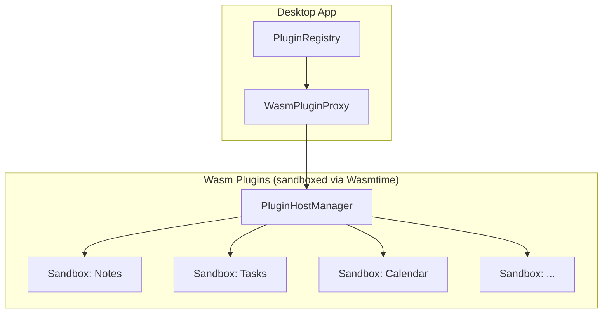
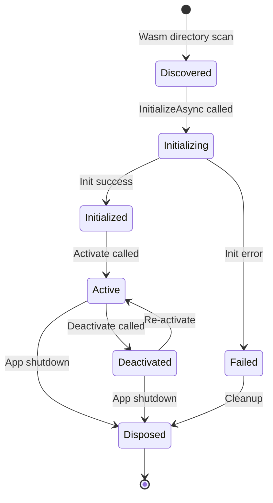

# Plugin Architecture

PrivStack is built on a plugin-first architecture. All major features (Notes, Tasks, Calendar, etc.) are plugins that use the same SDK available to third-party developers.

## Wasm-Only Plugin Runtime

All plugins run as **sandboxed WebAssembly Component Model** binaries inside Wasmtime. In-process C# plugins were deprecated due to security concerns — they run with full trust in the host process, meaning a malicious or buggy plugin could access any file, network resource, or memory the app can. Wasm sandboxing enforces capability-based permissions at the runtime level, providing true isolation.



## Plugin Lifecycle



### Lifecycle Methods

| Method | When Called | Purpose |
|--------|-----------|---------|
| `InitializeAsync` | App startup | Register schemas, set up services, connect to host |
| `Activate` | First navigation to plugin | Start background tasks, subscribe to events |
| `CreateViewModel` | First navigation | Create (or return cached) ViewModel |
| `OnNavigatedToAsync` | Tab selected | Load/refresh data for current view |
| `OnNavigatedFrom` | Tab deselected | Pause updates, save draft state |
| `Deactivate` | Plugin disabled | Stop background tasks |
| `Dispose` | App shutdown | Release all resources |

## C# Plugin SDK

### IAppPlugin Interface

All plugins implement `IAppPlugin` — Wasm plugins do so via `WasmPluginProxy`:

```csharp
public interface IAppPlugin : IDisposable
{
    PluginMetadata Metadata { get; }
    NavigationItem? NavigationItem { get; }
    ICommandProvider? CommandProvider { get; }
    PluginState State { get; }
    IReadOnlyList<EntitySchema> EntitySchemas { get; }

    Task<bool> InitializeAsync(IPluginHost host, CancellationToken ct = default);
    void Activate();
    void Deactivate();
    ViewModelBase CreateViewModel();
    void ResetViewModel();
    Task OnNavigatedToAsync(CancellationToken ct = default);
    void OnNavigatedFrom();
}
```

### IPluginHost (Host Services)

Services provided to plugins by the desktop app:

```csharp
public interface IPluginHost
{
    IPrivStackSdk Sdk { get; }          // Entity CRUD, vault, blob storage
    ICapabilityBroker Capabilities { get; } // Cross-plugin discovery
    IPluginSettings Settings { get; }    // Plugin-namespaced key-value config
    IPluginLogger Logger { get; }        // Structured logging
    INavigationService Navigation { get; } // Tab switching
    ISdkDialogService? DialogService { get; } // Modal dialogs
    Version AppVersion { get; }
}
```

### Data Operations (IPrivStackSdk)

```csharp
public interface IPrivStackSdk
{
    // Entity CRUD via message passing
    Task<SdkResponse<T>> SendAsync<T>(SdkMessage message, CancellationToken ct = default);

    // Search across entity types
    Task<SdkResponse<T>> SearchAsync<T>(
        string query, string[]? entityTypes = null,
        int limit = 50, CancellationToken ct = default);

    // Vault (encrypted blob storage)
    Task VaultInitialize(string vaultId, string password, CancellationToken ct = default);
    Task VaultUnlock(string vaultId, string password, CancellationToken ct = default);
    Task VaultBlobStore(string vaultId, string blobId, byte[] data, CancellationToken ct = default);
    Task<byte[]> VaultBlobRead(string vaultId, string blobId, CancellationToken ct = default);

    // Blob (unencrypted, plugin-scoped)
    Task BlobStore(string ns, string blobId, byte[] data, string? metadata = null, CancellationToken ct = default);
    Task<byte[]> BlobRead(string ns, string blobId, CancellationToken ct = default);
}
```

### SdkMessage

All entity operations are expressed as messages routed through the FFI layer:

```csharp
public sealed record SdkMessage
{
    public required string PluginId { get; init; }
    public required SdkAction Action { get; init; }    // Create, Read, Update, Delete, Query, etc.
    public required string EntityType { get; init; }
    public string? EntityId { get; init; }
    public string? Payload { get; init; }               // JSON
    public Dictionary<string, string>? Parameters { get; init; }
}

public enum SdkAction
{
    Create, Read, ReadList, Update, Delete, Query,
    Command, Trash, Restore, Link, Unlink, GetLinks
}
```

## Capabilities

Plugins can expose optional capabilities discovered at runtime via `ICapabilityBroker`:

### ILinkableItemProvider

Enables cross-plugin entity linking (used by the Graph plugin for knowledge graph visualization):

```csharp
public interface ILinkableItemProvider
{
    string LinkType { get; }               // e.g., "note", "task"
    string LinkTypeDisplayName { get; }
    string LinkTypeIcon { get; }

    Task<IReadOnlyList<LinkableItem>> SearchItemsAsync(
        string query, int maxResults = 20, CancellationToken ct = default);

    Task<LinkableItem?> GetItemByIdAsync(
        string itemId, CancellationToken ct = default);
}
```

### Other Capabilities

| Interface | Purpose |
|-----------|---------|
| `IStorageProvider` | Plugin-scoped storage access |
| `ITimerBehavior` | Pomodoro-style timers |
| `IShutdownAware` | Cleanup on app exit |
| `IDeepLinkTarget` | URI-based navigation (e.g., `privstack://notes/abc123`) |

## Plugin Metadata

```csharp
public sealed record PluginMetadata
{
    public required string Id { get; init; }        // "privstack.notes"
    public required string Name { get; init; }      // "Quill"
    public required string Description { get; init; }
    public required Version Version { get; init; }
    public int NavigationOrder { get; init; }        // Sort position in sidebar
    public PluginCategory Category { get; init; }
    public bool CanDisable { get; init; }
    public bool IsExperimental { get; init; }
    public bool IsHardLocked { get; init; }          // Locked behind license
}
```

### Navigation Order Ranges

| Range | Purpose |
|-------|---------|
| 100–199 | Primary plugins (Notes, Tasks, Calendar) |
| 200–299 | Secondary plugins (Contacts, Files) |
| 300–399 | Utility plugins (Passwords, Snippets) |
| 1000+ | Third-party plugins |

## Wasm Plugin Sandbox

The Wasmtime-based sandbox provides isolation and permission enforcement:

### Resource Limits

```rust
pub struct ResourceLimits {
    pub max_memory_bytes: usize,
    pub max_fuel: u64,          // CPU budget
    pub max_instances: u32,
}
```

### Permissions

```rust
pub enum Permission {
    EntityCrud,
    EntityQuery,
    ViewState,
    CommandPalette,
    VaultAccess,
    CrossPluginLink,
    DialogDisplay,
    TimerAccess,
    NetworkAccess,
}

pub enum PermissionTier {
    Core,       // Trusted first-party plugins
    Verified,   // Signed third-party plugins
    Community,  // Unsigned plugins (restricted)
}
```

### Policy Modes

```rust
pub enum PolicyMode {
    Strict,      // Only explicitly granted permissions
    Permissive,  // Default allow with audit logging
}
```

## Plugin Package Files

Each compiled plugin directory contains:

| File | Purpose |
|------|---------|
| `plugin.wasm` | Compiled WebAssembly binary |
| `metadata.json` | Plugin identity, version, icon, category |
| `schemas.json` | Entity schemas with indexed fields and merge strategies |
| `template.json` | Declarative UI layout definition |
| `command_palettes.json` | Command palette entries (block types, actions) |
