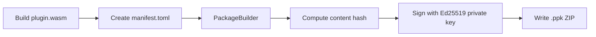

# Plugin Package Format (.ppk)

The `.ppk` (PrivStack Plugin Package) format is used for distributing, signing, and verifying plugins. It is implemented in the `privstack-ppk` crate.

## Format

A `.ppk` file is a ZIP archive with a defined structure:

```
plugin.ppk (ZIP)
├── manifest.toml           # Required: metadata, permissions, schemas
├── plugin.wasm             # Required: WebAssembly Component Model binary
├── signature.bin           # Optional: Ed25519 detached signature
├── icon.png                # Optional: 256x256 plugin icon
├── README.md               # Optional: documentation
└── views/                  # Optional: declarative UI definitions
    ├── main.json
    └── settings.json
```

## Manifest

The `manifest.toml` file declares plugin identity, required permissions, and entity schemas:

```toml
[package]
id = "privstack.notes"
name = "Quill"
description = "Block-based note editor with hierarchical organization"
version = "1.0.0"
author = "PrivStack"
icon = "FileText"
navigation_order = 110
category = "productivity"
can_disable = false
is_experimental = false
min_app_version = "0.8.0"

[[permissions]]
type = "EntityCrud"

[[permissions]]
type = "EntityQuery"

[[permissions]]
type = "ViewState"

[[permissions]]
type = "CommandPalette"

[[permissions]]
type = "CrossPluginLink"

[[schemas]]
entity_type = "note"
merge_strategy = "lww_per_field"

[[schemas.indexed_fields]]
field_path = "/title"
field_type = "text"
searchable = true

[[schemas.indexed_fields]]
field_path = "/body"
field_type = "text"
searchable = true
```

### Manifest Types

```rust
pub struct PpkManifest {
    pub id: String,
    pub name: String,
    pub description: String,
    pub version: String,
    pub author: String,
    pub icon: Option<String>,
    pub navigation_order: u16,
    pub category: String,
    pub can_disable: bool,
    pub is_experimental: bool,
    pub min_app_version: Option<String>,
    pub permissions: Vec<PpkPermission>,
    pub schemas: Vec<PpkEntitySchema>,
}
```

### Permission Types

| Permission | Description |
|-----------|-------------|
| `EntityCrud` | Create, read, update, delete entities of declared types |
| `EntityQuery` | Query/search entities |
| `ViewState` | Read/write plugin view state (UI preferences) |
| `CommandPalette` | Register commands in the command palette |
| `VaultAccess` | Read/write encrypted vault blobs |
| `CrossPluginLink` | Link entities across plugin boundaries |
| `DialogDisplay` | Show modal dialogs to the user |
| `TimerAccess` | Use timer/scheduling APIs |
| `NetworkAccess` | Make outbound network requests (restricted) |

## Signing and Verification

Plugins are signed with **Ed25519** keys. The signature covers all package contents except `signature.bin` itself, ensuring tamper detection.

### Signing Flow



### API

```rust
// Generate a new signing keypair
let keypair = KeyPair::generate();

// Build and sign a package
let ppk_bytes = PackageBuilder::new(manifest)
    .wasm(wasm_bytes)
    .readme(readme_bytes)
    .add_view("main", view_json)
    .sign(&keypair.signing_key)
    .build()?;

// Open and verify
let package = PpkPackage::open(Cursor::new(ppk_bytes))?;
package.verify(&keypair.verifying_key)?;

// Access contents
let manifest = package.manifest();
let wasm = package.wasm_bytes();
let hash = package.content_hash();
```

### Trust Tiers

| Tier | Signing | Permissions |
|------|---------|------------|
| **Core** | Signed with PrivStack key | Full access |
| **Verified** | Signed with registered developer key | Declared permissions |
| **Community** | Unsigned or unknown key | Restricted (no vault, no network) |

## Content Hashing

Each package has a SHA-256 content hash computed over all files (excluding the signature). This hash is:

- Used as the package identifier for caching
- Verified against the signature during installation
- Logged for audit purposes
