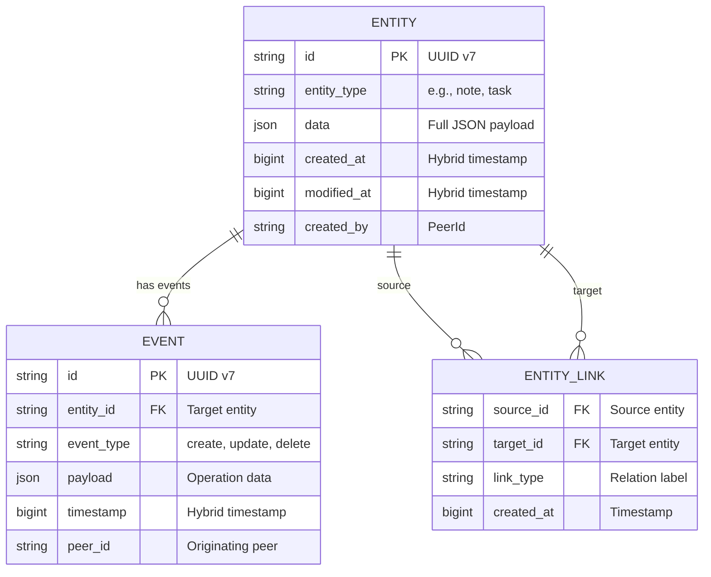
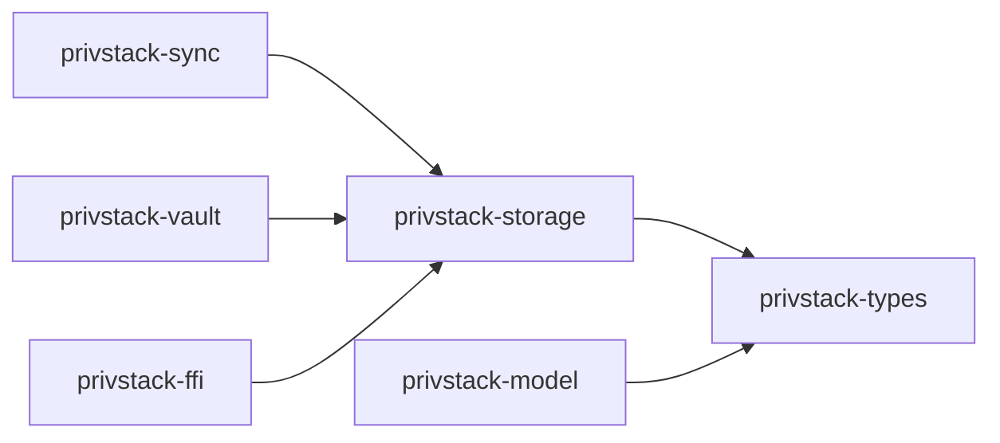

# Storage Layer

The `privstack-storage` crate provides DuckDB-backed persistence for entities and events.

## Overview

PrivStack uses **DuckDB** as its local database engine. DuckDB is an embedded analytical database (similar in spirit to SQLite) with excellent JSON support and WAL (Write-Ahead Logging) mode for concurrent reads during sync operations.

## Stores

### EntityStore

Persists entities as typed JSON documents with schema-driven field extraction for indexing.

```rust
pub struct EntityStore {
    // DuckDB connection + schema registry
}

impl EntityStore {
    // CRUD operations on Entity objects
    // Query by entity_type, indexed fields
    // Full-text search on searchable fields
    // Link management (entity-to-entity relations)
}
```

Entities are stored with their full JSON `data` payload. Indexed fields (declared in `EntitySchema`) are extracted into separate columns for efficient filtering and search.

### EventStore

An immutable, append-only log of all operations. Events are the unit of sync — they flow between peers and are replayed to reconstruct state.

```rust
pub struct EventStore {
    // DuckDB connection for event log
}

impl EventStore {
    // Append events
    // Query events by entity_id, peer_id, timestamp range
    // Get events since a vector clock position
    // Batch retrieval for sync
}
```

## Data Model



## DuckDB Configuration

- **WAL Mode** — Enables concurrent readers during write operations (critical during sync)
- **Embedded** — No separate database server; DuckDB runs in-process
- **JSON support** — Native JSON functions for payload querying
- **Automatic migrations** — Schema changes applied on startup

## Relationship to Other Crates



- **privstack-types** — Provides `EntityId`, `Event`, `HybridTimestamp`
- **privstack-model** — Defines `Entity`, `EntitySchema` that storage persists
- **privstack-sync** — Reads/writes events for peer synchronization
- **privstack-vault** — Uses DuckDB for encrypted blob indexing
- **privstack-ffi** — Exposes storage operations to .NET/mobile via C ABI
