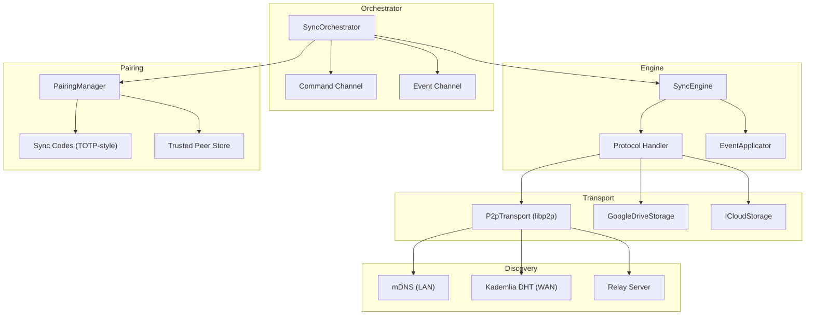
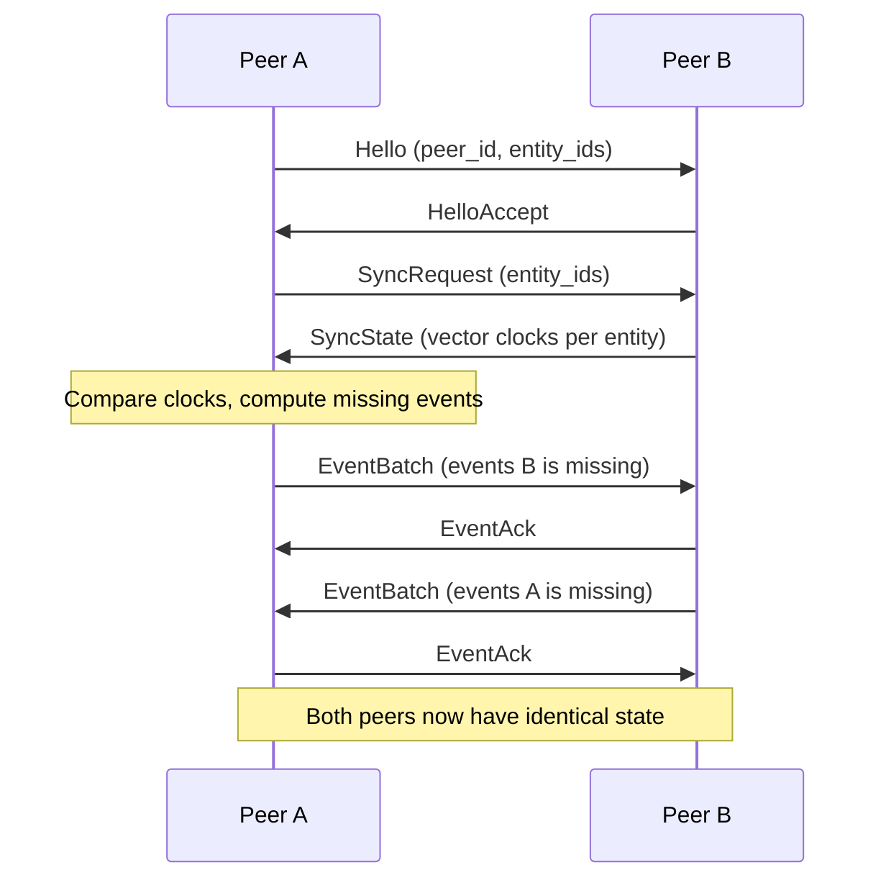
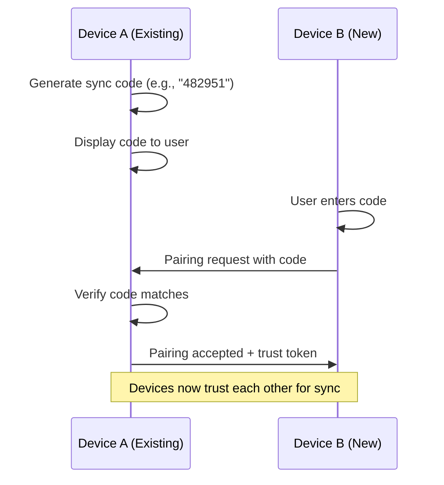

# Sync Engine

The `privstack-sync` crate implements PrivStack's P2P and cloud sync system. It handles peer discovery, event exchange, conflict-free merging, device pairing, and sync policies.

## Architecture



## Sync Protocol

The protocol is message-based, using vector clocks for state comparison and batched event transfer.

### Protocol Version

Current: `PROTOCOL_VERSION` (defined in `protocol.rs`)

### Message Types

| Message | Direction | Purpose |
|---------|-----------|---------|
| `HelloMessage` | Initiator → Responder | Announce identity and entity IDs |
| `HelloAckMessage` | Responder → Initiator | Accept or reject connection |
| `SyncRequestMessage` | Either → Either | Request events for specific entities |
| `SyncStateMessage` | Either → Either | Respond with vector clock state per entity |
| `EventBatchMessage` | Either → Either | Batch of events for an entity (up to `MAX_BATCH_SIZE`) |
| `EventAckMessage` | Either → Either | Acknowledge receipt of event batch |
| `EventNotifyMessage` | Either → Either | Notify peer of new local events |
| `SubscribeMessage` | Either → Either | Subscribe to real-time updates for entities |
| `ErrorMessage` | Either → Either | Protocol-level error |

### Sync Flow



## P2P Transport

Built on **libp2p** with the following features:

| Feature | Technology | Purpose |
|---------|-----------|---------|
| Transport | QUIC | Encrypted, multiplexed connections |
| LAN Discovery | mDNS | Zero-config local peer finding |
| WAN Discovery | Kademlia DHT | Internet-wide peer lookup |
| NAT Traversal | DCUtR + Relay | Hole-punching and relay fallback |
| Authentication | Noise protocol | Peer identity verification |
| Multiplexing | Yamux | Multiple streams per connection |

### Configuration

```rust
pub struct P2pConfig {
    pub listen_addr: String,        // e.g., "/ip4/0.0.0.0/udp/0/quic-v1"
    pub bootstrap_nodes: Vec<String>,
    pub enable_mdns: bool,
    pub enable_dht: bool,
    pub enable_relay: bool,
}
```

### Bootstrap Node

Clients discover the relay server's PeerId at runtime via HTTP:

```
GET http://<relay-ip>:4002/api/v1/identity
→ { "peer_id": "12D3Koo...", "addresses": [...] }
```

This eliminates hardcoded PeerIds in client code.

## Cloud Sync (Fallback)

When P2P is unavailable, users can optionally sync via cloud storage. The cloud layer implements the same event-based protocol but uses file storage as the transport.

### Google Drive

```rust
pub struct GoogleDriveConfig {
    pub client_id: String,
    pub client_secret: String,
    pub refresh_token: String,
    pub folder_name: String,
}
```

### iCloud Drive

```rust
pub struct ICloudConfig {
    pub container_path: String,
}
```

Both implement the `CloudStorage` trait:

```rust
pub trait CloudStorage: Send + Sync {
    async fn upload_events(&self, events: &[Event]) -> Result<()>;
    async fn download_events(&self, since: HybridTimestamp) -> Result<Vec<Event>>;
    async fn list_peers(&self) -> Result<Vec<PeerId>>;
}
```

## Device Pairing

New devices establish trust via **sync codes** — short TOTP-style codes displayed on one device and entered on another.



### PairingManager API

```rust
impl PairingManager {
    pub fn generate_sync_code(&self) -> SyncCode
    pub fn verify_sync_code(&self, code: &SyncCode) -> bool
    pub fn trust_peer(&mut self, peer_id: PeerId, info: DiscoveredPeerInfo)
    pub fn is_trusted(&self, peer_id: &PeerId) -> bool
    pub fn trusted_peers(&self) -> Vec<TrustedPeer>
    pub fn revoke_trust(&mut self, peer_id: &PeerId)
}
```

## Sync Policies

Policies control what data syncs with which peers:

### Personal Policy

Default for individual users. All trusted peers sync all entity types.

```rust
pub struct PersonalSyncPolicy {
    // Syncs everything with all trusted peers
}
```

### Enterprise Policy

ACL-based access control with roles and entity-type restrictions.

```rust
pub struct EnterpriseSyncPolicy {
    // Role-based: Admin, Member, ReadOnly
    // Per-entity-type ACLs
    // Team-scoped sync boundaries
}

pub enum SyncRole {
    Admin,
    Member,
    ReadOnly,
}

pub struct EntityAcl {
    pub entity_type: String,
    pub allowed_roles: Vec<SyncRole>,
    pub team_id: Option<TeamId>,
}
```

### Policy Trait

```rust
pub trait SyncPolicy: Send + Sync {
    fn can_send(&self, entity_type: &str, peer_id: &PeerId) -> bool;
    fn can_receive(&self, entity_type: &str, peer_id: &PeerId) -> bool;
    fn audit(&self, action: AuditAction) -> AuditDecision;
}
```

## Orchestrator

The `SyncOrchestrator` runs the sync engine as a background task, exposing a command/event channel for the UI layer:

```rust
pub struct OrchestratorConfig {
    pub sync_config: SyncConfig,
    pub p2p_config: P2pConfig,
    pub cloud_config: Option<CloudConfig>,
    pub db_path: PathBuf,
}

pub enum SyncCommand {
    Start,
    Stop,
    ForceSync,
    AddPeer(PeerId),
    RemovePeer(PeerId),
    PairDevice(SyncCode),
}

pub enum SyncEvent {
    PeerConnected(PeerId),
    PeerDisconnected(PeerId),
    SyncCompleted(PeerId),
    SyncError(PeerId, String),
    EntitiesUpdated(Vec<EntityId>),
    PairingCompleted(PeerId),
}
```

### Factory Functions

```rust
pub fn create_personal_orchestrator(config: OrchestratorConfig) -> OrchestratorHandle
pub fn create_enterprise_orchestrator(config: OrchestratorConfig) -> OrchestratorHandle
pub fn create_orchestrator_with_pairing(config: OrchestratorConfig) -> OrchestratorHandle
```
